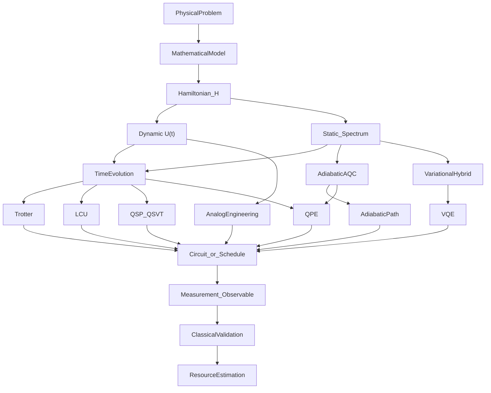

# ۰. نقشهٔ زنده

## جایگاه در نقشه

این فایل خودِ نقشه است. بقیهٔ فصل‌ها به اینجا ارجاع می‌دهند.

## ایدهٔ شهودی

پژوهش شبیه‌سازی کوانتومی (quantum simulation) یک خط مستقیم از «فیزیک» به «مدار» نیست. نخست یک مسئله فیزیکی به مدل ریاضی و سپس به هامیلتونی \(H\) تبدیل می‌شود. بعد باید دو چیز را جدا کرد:

- **چه پرسشی از \(H\) دارید؟** تحول زمانی، یا طیف / حالت پایه؟
- **با کدام رهیافت به آن می‌رسید؟** پیاده‌سازی \(U(t)\) یا \(f(H)\)، مسیر آدیاباتیک، مهندسی آنالوگ، یا حلقهٔ وردشی.

ابزارهایی مثل Trotter، LCU و QSP زیرِ رهیافت‌اند، نه هم‌سطح آن. برآورد فاز (phase estimation, QPE) روی مرز دینامیک و طیف می‌نشیند، چون به تحول کنترل‌شده نیاز دارد.

اگر وسط جزئیات گم شدید: به این صفحه برگردید و بپرسید «سؤال من کدام است؟ رهیافت کدام است؟ ابزار کدام است؟»

## حداقل فرمالیسم

جریان کاری (workflow) کلی:

تصحیح‌های مفهومی نسبت به نمودار خام اولیه:

- Trotter / LCU / QSP نخست پیاده‌کنندهٔ \(f(H)\) هستند؛ \(U(t)=e^{-iHt}\) فقط یک کاربرد است.
- QPE فقط «طیفی» نیست؛ به تحول کنترل‌شده نیاز دارد.
- مسیر آدیاباتیک هم‌سطح Trotter نیست؛ یک **رهیافت** است.
- VQE الگوریتم ترکیبی (hybrid) است، نه تجزیهٔ \(e^{-iHt}\).
- شبیه‌سازی آنالوگ ممکن است از مدار گیتی عبور نکند.

### جدول مسئله → رهیافت → ابزار

| اگر می‌خواهید… | پرسش | رهیافت اصلی | ابزار نوعی | فصل |
|---|---|---|---|---|
| \(\lvert\psi(t)\rangle\) یا مشاهده‌پذیر وابسته به زمان | دینامیک | تحول زمانی / \(f(H)\) | Trotter، LCU، QSP | [۷](07-dynamics-vs-spectrum.md)، [۹](09-digital-primitives.md) |
| انرژی پایه یا گاف | ایستا / طیفی | وردشی، آدیاباتیک، یا QPE | VQE، مسیر \(H(s)\)، QPE | [۷](07-dynamics-vs-spectrum.md)، [۸](08-evolution-vs-adiabatic.md)، [۱۰](10-spectral-tools.md) |
| ویژهٔمقدارهای \(H\) با دقت بالا | طیفی | تحول کنترل‌شده + برآورد فاز | شبیه‌سازی \(U\) سپس QPE | [۱۰](10-spectral-tools.md) |
| تابع پاسخ / Green | پل دینامیک–طیف | \(f(H)\) یا تحول | QSP، QPE | [۷](07-dynamics-vs-spectrum.md) |
| مهندسی مستقیم \(H\) روی سخت‌افزار | دینامیک یا ایستا | آنالوگ | نگاشت \(H_{\mathrm{target}}\) | [۱۱](11-analog-hybrid.md) |
| محاسبه = ماندن در حالت پایهٔ لحظه‌ای | ایستا | آدیاباتیک | زمان‌بندی \(H(s)\) | [۸](08-evolution-vs-adiabatic.md) |

## ارتباط

- قرارداد خواندن و قالب فصل‌ها: [README.md](README.md)
- واژگان: [glossary.md](glossary.md)
- سه لایهٔ مفهومی: [04-three-layers.md](04-three-layers.md)
- جریان کاری با مثال: [06-pipeline.md](06-pipeline.md)
- درخت تصمیم هنگام مسئلهٔ تازه: [13-research-compass.md](13-research-compass.md)

## چه وقت استفاده می‌شود

هر بار که یک مقاله، یک روش، یا یک ایدهٔ پژوهشی جدید دیدید و ندانستید «این زیر کدام شاخه است».

## جای توسعه

- افزودن سطر برای مسائل گرمایی، سامانهٔ کوانتومی باز، و ترابرد.
- نسخهٔ تعاملی‌تر نمودار (تفکیک digital adiabatic از analog adiabatic).
- پیوند هر خانهٔ جدول به یادداشت مقالات مرجع.
